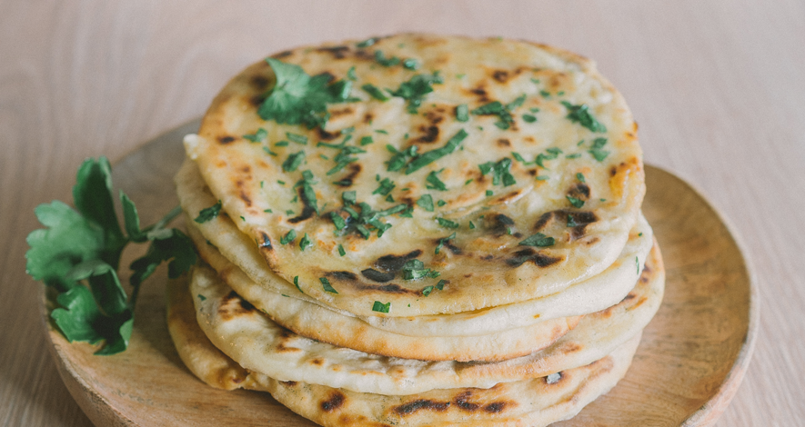

# Les Naans

  

## Présentaiton

Ce pain, aprrécié par tout le monde que ce soit *par les petits ou par les grands*, est originaire d'Asie du sud.  Connu pour sa tendresse, le Naan exitse également souus différentes versions revisités.[^1] Celui a été inventé par la __famille Gupta__ à Paris en 1976.[^2]
Ce plat est traditionnellement cuit dans un *[tandoor](https://fr.wikipedia.org/wiki/Tandoor)*, un four traditionnel utilisé en Inde et Asie centrale.

 

## Différentes variantes du naans

Il existe environ 20 types de Naans.[^3] Bien que le plain Naan (le Naan simple) soit agréable à manger, ses variantes peuvent nous offrir de meuilleurs saveurs. Je vais vous lister quelques-unes:

| Variante du Naan         | Description                                               | Image                                                            |
|--------------------------|-----------------------------------------------------------|------------------------------------------------------------------|
|Garlic and Coriander Naan | Ce Naan est garni avec d'ail et de coriandre              |        |
| Butter Naan              | Ce Naan est garni avec du  beurre fondu                   |          |
| Cheese Naan              | Ce Naan est farci avec du fromage, souvent avec du paneer |  |
|  Stuffed Naan            | Ce Naan est farci souvent avec de la pomme de terre (Aloo Naan) ou des épinards  (palak Naan) |         |

## Recette du Cheese Naan 

Auteur @Theo-radj

[^1]: [Naan — Wikipédia](https://fr.wikipedia.org/wiki/Naan)

[^2]: [Le "Cheese Naan" Indien inventé à Paris](https://www.leguidedufromage.com/cheese-naan-invention-france-zo178.html)

[^3]: [Top 20 Types of Naan To Have With Gravy - Crazy Masala Food](https://www.crazymasalafood.com/top-20-types-of-naan-to-have-with-gravy/)
